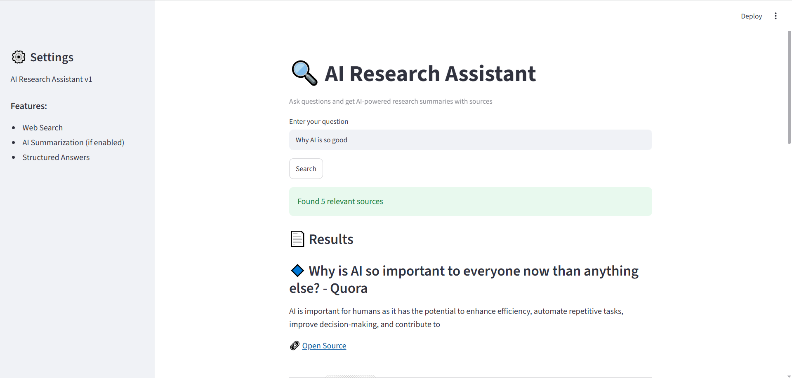

# 🔍 AI Research Assistant (Agent-Based System)

An AI-powered research assistant that takes a user query, searches the web, and returns structured, readable research results using an agent-based architecture.

---

## 🚀 Features

- 🌐 Web search using Tavily API  
- 🧠 Agent-based orchestration layer  
- 📄 Structured output formatting  
- 💻 Streamlit web UI  
- 🔗 Clickable source links  
- ⚡ Fast and lightweight design  

---

## 🧠 Architecture

User Query  
→ Streamlit UI  
→ Agent Orchestrator  
→ Tavily Search Tool  
→ Result Processing Layer  
→ UI Rendering  

---

## 🛠️ Tech Stack

- Python  
- Streamlit  
- Tavily API  
- dotenv  
- Modular Agent Architecture  

---


## 📸 UI Preview



## ▶️ How to Run

```bash
pip install -r requirements.txt
streamlit run app.py